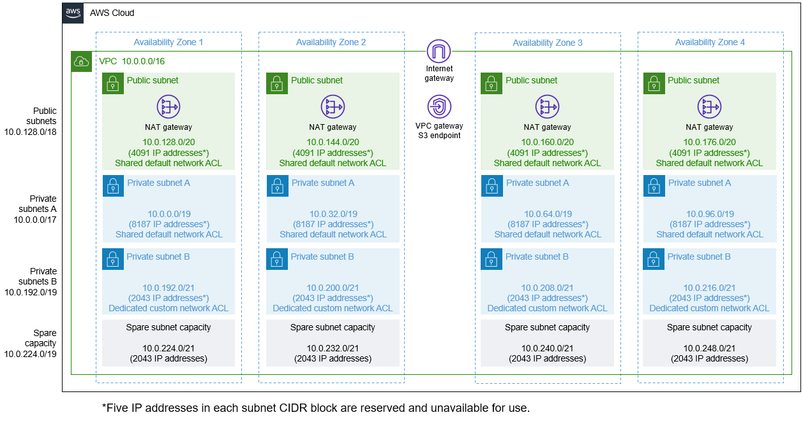
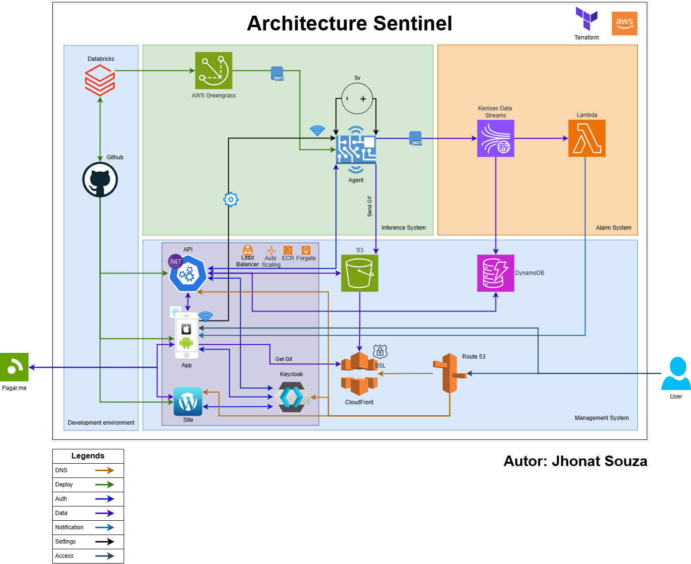

<h1 align="center">
   <a href="#"> Template Ifrastructure as Code </a><br />
   <small>(Terraform)</small>
</h1>

<h3 align="center">
    This Terraform code implements the AWS architecture for the  Template project, based on the <a href="https://dev.azure.com/neuaieng/AKL-2023-001-23001-MonitoramentoDeAtivos/_git/doc?version=GBmaster&path=/02.Analise/arquitetura/AKL-2023-001-23001-SFT-001-ArquiteturaSistema.docx">Architecture Documentation</a>. It utilizes the <a href="https://aws.amazon.com/solutions/implementations/vpc/">AWS VPC Solution</a> Pattern and follows a serverless approach.
</h3>

</p>

<h4 align="center">
    Status: Finished
</h4>

<p align="center">
 <a href="#about">About</a> •
 <a href="#how-it-works">How it works</a> •
 <a href="#tech-stack">Tech Stack</a>


## About

The  Template project utilizes the AWS VPC Solution Pattern to implement its architecture. This pattern provides a secure and isolated network environment for the project's resources. It allows for the segmentation of resources into different subnets, enabling better control over network traffic and access.

<!-- 


In addition to the AWS VPC Solution Pattern, the  Template project follows a serverless approach. This means that instead of managing and provisioning servers, the project leverages AWS services such as AWS Lambda, AWS API Gateway, and AWS DynamoDB to build scalable and cost-effective solutions. By adopting a serverless architecture, the project benefits from automatic scaling, reduced operational overhead, and pay-per-use pricing model. -->




## How it works

1. Install opentofu: https://opentofu.org/docs/intro/install/
1. Install aws cli: https://docs.aws.amazon.com/cli/latest/userguide/getting-started-install.html
1. Docker: https://docs.docker.com/engine/install/
1. Configure aws profile: `aws configure --profile=YOUR_PROFILE_NAME`
1. Clone repository: `git clone git@github.com:-org/IaC.git`
1. Enter in `IaC` folder
1. Inside the location of repository create file `ENVIRONMENT_NAME.s3.tfbackend` with example content:
    ```
    bucket = "bucket-name-to-store-tfstate-tf-state"
    key = "ENVIRONMENT_NAME.tfstate"
    region = "us-east-1"
    profile = "YOUR_PROFILE_NAME" #same of the step 3
    ```
1. Run the following command to create the bucket with versioning activated:
    ```
    aws s3api create-bucket --bucket bucket-name-to-store-tfstate-tf-state --region us-east-1 --create-bucket-configuration LocationConstraint=us-east-1 --profile YOUR_PROFILE_NAME

    aws s3api put-bucket-versioning --bucket bucket-name-to-store-tfstate-tf-state --versioning-configuration Status=Enabled --profile YOUR_PROFILE_NAME
    ```
1. Inside the location of repository create file `ENVIRONMENT_NAME.tfvars` with example content:
    ```
    environment = "ENVIRONMENT_NAME"
    project_alias = "neuai-project-alias"
    project_code = "neuai-project-code"
    project_cost_center = "neuai-cost-center"
    project_pep = "neuai-pep"
    region = "us-east-1"
    dns_zone_name = "your-domain"
    initial_db_name = "INITIAL_DB_NAME"
    master_username = "MASTER_DB_USERNAME"
    master_password = "MASTER_DB_PASSWORD"
    ```
1. run: `tofu init -backend-config=./ENVIRONMENT_NAME.s3.tfbackend`
1. run: `tofu apply -var-file ENVIRONMENT_NAME.tfvars`
## Tech Stack
- [Terraform (Opentofu)](https://opentofu.org/)
- [AWS Cli](https://aws.amazon.com/pt/cli/)
